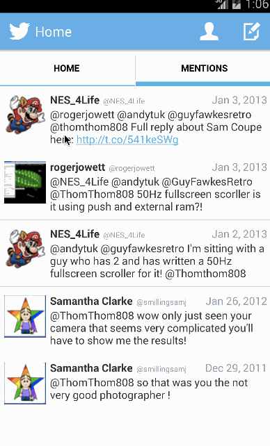

Android Twitter Client
======================

An app that allows Twitter users to view their timeline and their profile, to compose new tweets and to view the profiles of others; the week 4 CodePath assignment.

Time spent: 3 hours (plus 4 for week 3 assignment)

# Completed user stories
* [x] Required: user can sign in to Twitter using OAuth login;
* [x] Required: user can view the tweets from their home timeline
 * [x] Required: user should be displayed the username, name, and body for each tweet;
 * [x] Required: user should be displayed the relative timestamp for each tweet "8m", "7h”;
 * [x] Required: user can view more tweets as they scroll with infinite pagination;
 * [x] Optional: links in tweets are clickable and will launch the web browser;
* [x] Required: user can compose a new tweet;
 * [x] Required: user can click a “Compose” icon in the Action Bar on the top right;
 * [x] Required: user can then enter a new tweet and post this to twitter;
 * [x] Required: user is taken back to home timeline with new tweet visible in timeline;
* [x] Required: user can switch between Timeline and Mention views using tabs;
 * [x] Required: user can view their home timeline tweets;
 * [x] Required: user can view the recent mentions of their username;
 * [x] Required: user can scroll to bottom of either of these lists and new tweets will load ("infinite scroll”);
 * [x] Optional: implement tabs in a gingerbread-compatible approach;
* [x] Required: user can navigate to view their own profile;
 * [x] Required: user can see picture, tagline, # of followers, # of following, and tweets on their profile;
* [x] Required: user can click on the profile image in any tweet to see another user's profile;
 * [x] Required: user can see picture, tagline, # of followers, # of following, and tweets of clicked user;
 * [x] Required: profile view should include that user's timeline;
* [x] Optional: user can see a counter with total number of characters left for tweet;
* [x] Bonus: compose activity is replaced with a modal overlay.

# User Sign In

# User’s Timeline and Mentions, showing infinite pagination and link follow-through

# Composition

# Profiles
