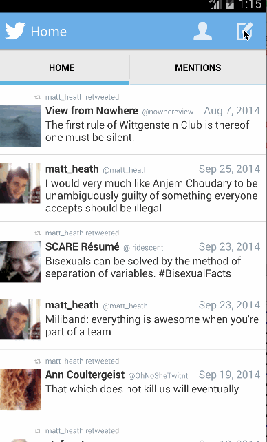

Android Twitter Client
======================

An app that allows Twitter users to view their timeline and to compose new tweets; the week 3 CodePath assignment.

Time spent: 4 hours

# Completed user stories
* [x] Required: user can sign in to Twitter using OAuth login;
* [x] Required: user can view the tweets from their home timeline
 * [x] Required: user should be displayed the username, name, and body for each tweet;
 * [x] Required: user should be displayed the relative timestamp for each tweet "8m", "7h”;
 * [x] Required: user can view more tweets as they scroll with infinite pagination;
 * [x] Optional: Links in tweets are clickable and will launch the web browser;
* [x] Required: user can compose a new tweet;
 * [x] Required: user can click a “Compose” icon in the Action Bar on the top right;
 * [x] Required: user can then enter a new tweet and post this to twitter;
 * [x] Required: user is taken back to home timeline with new tweet visible in timeline;
* [x] Optional: User can see a counter with total number of characters left for tweet;
* [x] Bonus: Compose activity is replaced with a modal overlay.

# User Sign In

# User’s Timeline, showing infinite pagination

# Composition
